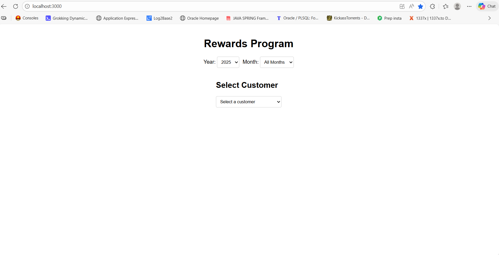
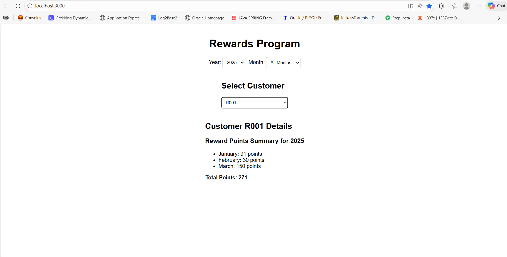
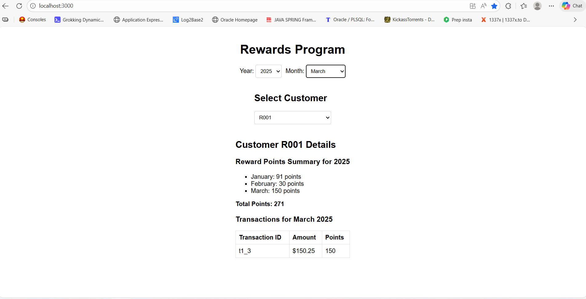
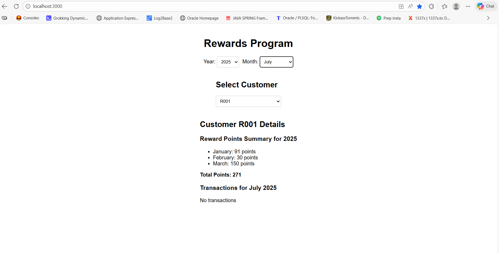

# Rewards Program Application

A React-based application for managing a retailer's rewards program. Customers earn points based on their purchases, and the app displays reward points per month and total, with filtering and pagination.

## Features

- Display customers in a dropdown select
- Select a customer to view reward points summary per month and total
- Filter by year and month
- View detailed transactions for a selected month
- Responsive UI with styled components
- Unit tests for reward calculation logic
- Logging for API calls and user interactions

## Project Setup

### Prerequisites

- Node.js (version 14 or higher)
- npm (comes with Node.js)

### Installation

1. Clone or download the project.
2. Navigate to the project directory: `cd rewards-app`
3. Install dependencies: `npm install`

### Running the Application

1. Start the development server: `npm start`
2. Open your browser and go to `http://localhost:3000`

### Running Tests

- Run tests: `npm test`
- Run tests in watch mode: `npm test -- --watchAll`
- Run tests once: `npm test -- --watchAll=false`

### Building for Production

- Build the app: `npm run build`
- The build artifacts will be stored in the `build/` directory.

## Component Details

### App.js
The main component that manages the application state, fetches data, and renders child components.

- **Props**: None
- **State**:
  - `transactions`: Array of transaction objects
  - `loading`: Boolean for loading state
  - `error`: String for error messages
  - `selectedCustomer`: String for selected customer ID
  - `selectedYear`: Number for selected year
  - `selectedMonth`: String for selected month
  - `currentPage`: Number for current page in pagination

### Filters.js
Component for year and month dropdown filters.

- **Props**:
  - `selectedYear`: Number (required)
  - `onYearChange`: Function (required)
  - `selectedMonth`: String
  - `onMonthChange`: Function (required)

### CustomerSelect.js
Displays a dropdown select for customers.

- **Props**:
  - `customers`: Array of strings (required)
  - `selectedCustomer`: String
  - `onCustomerSelect`: Function (required)

### CustomerDetails.js
Shows reward points summary and transaction details for a selected customer.

- **Props**:
  - `customer`: String
  - `transactions`: Array of transaction objects (required)
  - `selectedYear`: Number (required)
  - `selectedMonth`: String

### Utils

#### rewards.js
Contains the `calculatePoints` function for computing reward points.

- `calculatePoints(amount)`: Returns the points earned for a given amount.

#### api.js
Handles API simulation for fetching transactions.

- `fetchTransactions()`: Asynchronous function that fetches transaction data from a local JSON file.

### Constants

#### constants.js
Defines application constants.

- `MONTHS`: Array of month names
- `YEARS`: Array of available years
- `DEFAULT_YEAR`: Default selected year
- `ITEMS_PER_PAGE`: Number of customers per page

## Data Structure

Transactions are stored in `public/data/transactions.json` with the following structure:

```json
[
  {
    "customerId": "string",
    "transactionId": "string",
    "amount": number,
    "date": "ISO string"
  }
]
```

## Reward Calculation Logic

- 2 points for every dollar spent over $100
- 1 point for every dollar spent between $50 and $100
- 0 points for amounts under $50

Example: $120 purchase = 2 × $20 + 1 × $50 = 90 points

## Screenshots

### Application Interface
- Main screen showing filters, customer list, and details.

### Test Results
Running `npm test -- --watchAll=false` shows:

```
 PASS  src/utils/rewards.test.js
 PASS  src/App.test.js

Test Suites: 2 passed, 2 total
Tests:       9 passed, 9 total
Snapshots:   0 total
Time:        3.503 s
Ran all test suites.
```

### Success Test Cases
- Positive cases: Amounts over 100, between 50-100
- Negative cases: Amounts under 50
- Fractional values: Correctly handled with flooring

## Technologies Used

- React 18
- Styled Components
- PropTypes
- Jest (for testing)
- Create React App

## Folder Structure

```
src/
├── components/
│   ├── Filters.js
│   ├── CustomerSelect.js
│   └── CustomerDetails.js
├── utils/
│   ├── rewards.js
│   └── rewards.test.js
├── services/
│   └── api.js
├── constants.js
├── App.js
├── App.test.js
└── index.js
public/
└── data/
    └── transactions.json
```

## Notes

- The application simulates API calls with a delay for loading state.
- Logging is implemented using console.log for development.
- All components use functional components and hooks.
- Data is fetched from a local JSON file to simulate backend interaction.

## App screens



